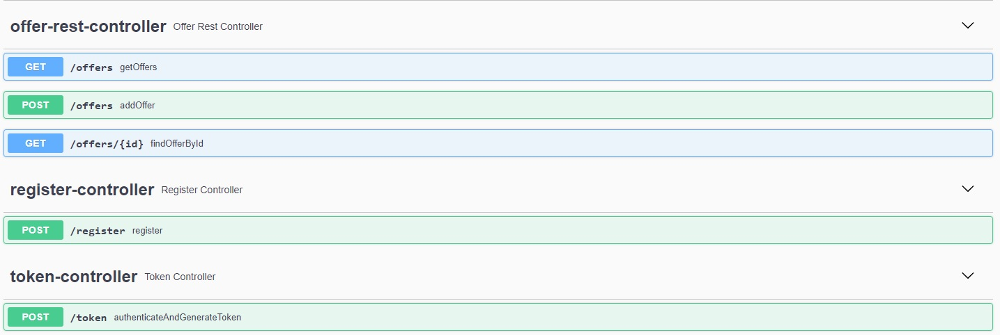

# JobOffers Application

## About project
Web application, which is created in Spring Boot. Users can display offers,
which are fetching by scheduler. Also authorized users by token, can add their new offers.
The main functionality of this project is collecting offers, from various sources, in one place.
Full version of project will be available on AWS soon.


## Main responsibilities application
<ul>
<li>Registration new users</li>
<li>Viewing offers</li>
<li>Authorisation by token</li>
<li>Adding new offers by authorized users</li>
<li>Fetching offers from server using Scheduler</li>
</ul>

## Endpoints



## Technologies used in project

Code: <br>
  
  
  
  
  
  
  


Test: <br>
  
  
  
  
  

<br>

## Installation and run

#### Requirements:
<li>Docker</li>


#### To run this project:
<li>Just run following command and wait for containers to be pulled up and started. </li>  

```
docker compose up
```

<li>Alternatively you can run docker-compose file through your IDE</li>

<br>

After everything build and ready, you can start application and test using Swagger or Postman

## In future
There are some plans to do in the future:  
<li>implement simple frontend</li> 
<li>deploying application on AWS</li>
<li>add new roles like ADMIN who would be able to remove offers or users</li>
<li>add other websites from which user can fetch new offers</li>
